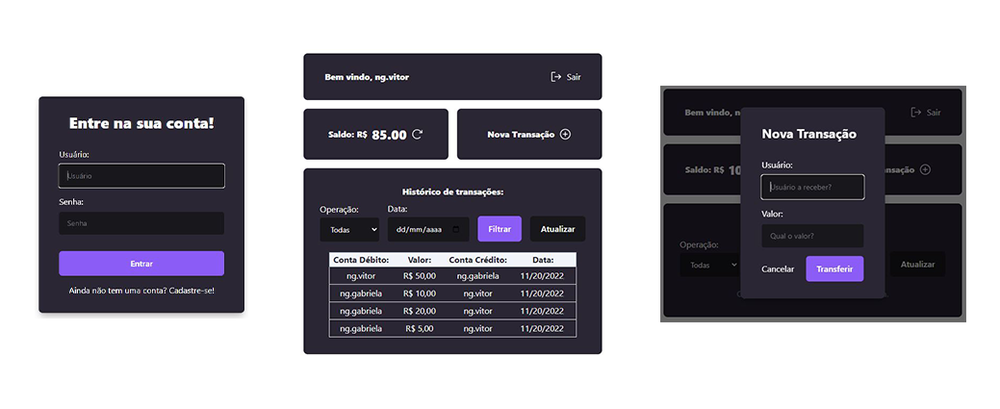
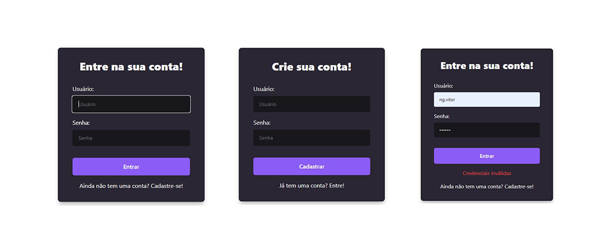
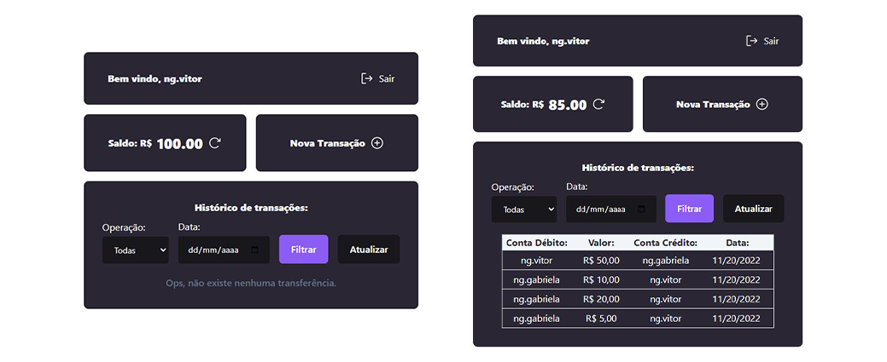
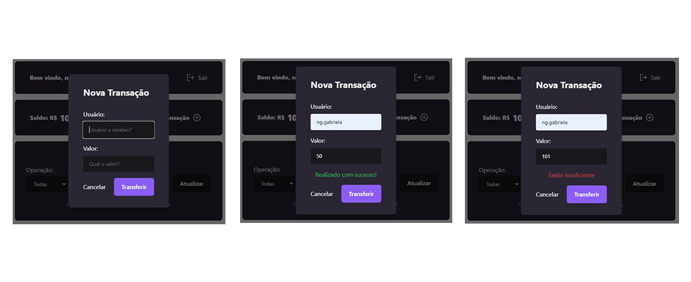

# FrontEnd

O FrontEnd possui uma interface minimalista e consome a API desenvolvida no BackEnd, simula uma aplicação de uma conta financeira, onde é possível fazer login com `username` e `password`, consultar o balanço de um usuário, transferir dinheiro para outros usuários e consultar o extrato de transações de um usuário, podendo filtrar por data e tipo de operação (cash-in/cash-out).
Foi desenvolvido em `ReactJS` com `TypeScript` e criado utilizando `Vite`. A estilização foi feita com `Tailwind CSS` e `Radix-UI`, com ícones da biblioteca `phosphor-icons` e `Axios` para fazer as requisições à API.

Demo:


## Conteúdo

- [FrontEnd](#frontend)
  - [Conteúdo](#conteúdo)
- [**Recursos**](#recursos)
    - [**Login/Cadastra-se**](#logincadastra-se)
    - [**Home**](#home)
    - [**Transferência**](#transferência)
- [**Instruções**](#instruções)
      - [](#)
- [**Observações**](#observações)

# **Recursos**
Os recursos serão listados conforme as páginas/componentes.

### **Login/Cadastra-se**

A tela inicial é a de login, onde é possível fazer login com um usuário já cadastrado ou cadastrar um novo usuário. Um mesmo componente é responsável tanto pelo login quanto pelo cadastro, onde o usuário pode alternar entre as duas telas clicando no botão "Cadastrar-se" ou "Já tenho uma conta". Em caso de erros de validação, o usuário é notificado uma mensagem recebida pela API.



### **Home**

A home é a página principal da aplicação, onde é possível consultar o saldo e o extrato de transações de um usuário e fazer transações. O saldo é exibido em uma caixa de texto e o extrato é exibido em uma tabela, onde é possível filtrar por data e tipo de operação (cash-in/cash-out). O usuário pode fazer logout clicando no botão "Sair" no canto superior direito da tela.



### **Transferência**

A transferência é acionada pelo botão "Transferir" na home, onde é possível fazer uma transferência para outro usuário. O usuário deve informar o `username` do destinatário, o valor da transferência. Em caso de erros de validação, o usuário é notificado uma mensagem recebida pela API.



# **Instruções**

Para executar o projeto utilizando Docker siga as instruções no README na raiz do repositório: [aqui](https://github.com/vitorbss12/Full-Stack-Financial-Transfer-System)

`Scripts` de instalação e execução:
####
**Instalar dependências:**
````
npm install
````

**Iniciar a aplicação:**
````
npm start
````

Para que a aplicação funcione corretamente, é necessário que o BackEnd e o Banco de Dados esteja, rodando.

# **Observações**

- Quer saber mais sobre mim? Veja o meu [LinkedIn](https://www.linkedin.com/in/vitorbss/).
